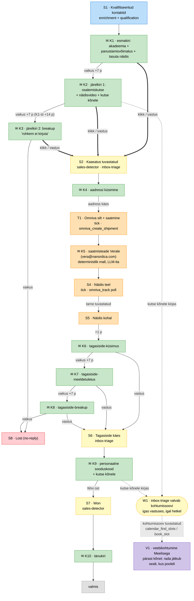

# Ravimus e-maili lehter v2 (A+D liidetud)

*Kanooniline allikas: Joplini märkus "Elnora – email-rajad v2 (A+D liidetud, ettepanek 2026-07-27)" (Nanordica → AI sales); see fail on selle repo-koopia seisuga 2026-07-28. Asendab v1 disaini kirjade-voo osa; v1 kirjakoopiad (LV mustandid) elavad Joplini v1 märkuses ja tuleb uue struktuuri järgi ümber jagada — keelekontrolli leiud: [email-rajad-review-findings.md](email-rajad-review-findings.md).*

**Numeratsioon:** K# = kiri (iga kiri eraldi kastis) · S# = seisund · T# = tick/deterministlik samm · V1 = veebikohtumine (varem C1) · W1 = valve. **Värv = vastutav roll, alati sama:** 🟢 outreach-writer (LLM-kirjad vetile) · 🟡 sales-detector / inbox-triage (signaalituvastus) · 🔵 enrichment + qualification · 🟣 inimene (Meelis) / kõne · 🟠 tick + omniva_* (firmasisene Omniva-plokk, sh K5) · 🔴 Lost · hall AINULT mitte-agentne lõpp-punkt.

## Vana → uus ID kaart

| Vana | Uus | | Vana | Uus |
|---|---|---|---|---|
| Q | S1 | | E5-B | K6 |
| AD / E1 | K1 | | fb-FU1 | K7 |
| FU1 | K2 | | fb-FU2 | K8 |
| FU2 | K3 | | D3 | S6 |
| E3-B | K4 | | D5 | K9 |
| E4-B | T1 + K5 | | S (Won) | S7 |
| D2 | S4 | | tänukiri | K10 |
| D2K | S5 | | F (Lost) | S8 |
| K (otsus) | — (kõnesamm eemaldatud 28.07) | | C1 | V1 |

## Muudatused v1 → v2

1. **A+D liidetud**: esmakiri K1 = akadeemia tutvustus + info võimalusest akadeemiasse panustada + tasuta näidise pakkumine. Eraldi Rada A kaob.
2. **Redel lüheneb**: 5 kirja (3/5/8/13 p) → K1 + K2 (+7 p) + K3 (+14 p, breakup). K2 = osalemispakkumine akadeemias + näidisvideo + kutse kõnele (V1). K3 = meenutab eelmisi kirju, ütleb et rohkem ei kirjuta → Lost. **Klikk/vastus viib S2-sse ka K3-st** — breakup-kirja hiline vastus püütakse kinni.
3. **Kaasatus (klikk/vastus) → kohe näidiseni**: K4 (aadressi küsimine) → Omniva saatmine.
4. **T1–S5 = firmasisene Omniva-plokk, LLM-i pole**: silt, saatmine, tarne jälgimine on deterministlikud tick-sammud. **K5 = saatmisteade Nanordica töötajale (vera@nanordica.com)** — deterministlik mall (silt + jälgimisnumber + pakomaat), mitte outreach-writeri kiri; vetile eraldi saatmisteadet ei lähe. *(Realiseeritud: `mcp/scripts/omniva_mail_dispatch.py` + cron; e2e kinnitatud 28.07, saadetis CC467134858EE.)*
5. **Tagasiside otse kirjaga** (kõnesamm S5 ja K6 vahelt eemaldatud 28.07): näidis kohal (S5) → **+1 p → K6** tagasiside-küsimus. Tagasiside (S6) tuleb K6 (või K7/K8) vastusest. K6 vaikus → K7 (+7 p), K8 (+14 p) → Lost.
6. **Tagasiside antud → K9** (personaalne sooduskood) → ost → Won. Ost tuvastatakse K9 koodi kaudu ("ost ilma koodita" ühendus eemaldatud — pole vajalik).
7. **V1 (veebikohtumine Meelisega) = valikuline kõrvalrada, järjekord kutse → valve → kohtumine**: kutse kõnele on kirjas K2-s ja K9-s → vastuse püüab **W1** (inbox-triage valvab kohtumissoovi IGAS vastuses, igal hetkel) → **V1 järgneb W1-le** (calendar_find_slots → calendar_book_slot). Pärast kõnet jätkab deal sealt, kus rada pooleli oli. Inimese (Meelise) samm on AINULT V1.

## Lehter v2 (graaf)

**Legend (värv = roll, alati sama):** 🟢 roheline = outreach-writer — K1–K4, K6–K10 (LLM-kirjad vetile) · 🟠 oranž = tick + omniva_* — T1, **K5**, S4, S5 (firmasisene Omniva-plokk, LLM-ita) · 🟡 kollane = sales-detector / inbox-triage — S2, S6, S7, W1 · 🔵 sinine = enrichment + qualification — S1 · 🟣 lilla = inimene (Meelis) — V1 · 🔴 punane = Lost — S8 · hall = "valmis" (pole agent). Katkendjoon = valikuline kõrvalrada: kutse (K2/K9) → W1 valve → V1.

## Kirjade kaart v2

| Kiri | Vana ID | Saaja | Käivitab | Ajastus | Kes |
|---|---|---|---|---|---|
| **K1** akadeemia + panustamine + näidis | E1 | vet | Qualified | päev 0 | outreach-writer |
| **K2** osalemiskutse + näidisvideo + kutse kõnele | FU1 | vet | vaikus | +7 p | outreach-writer |
| **K3** breakup | FU2 | vet | vaikus | +14 p (K1-st) → Lost; klikk/vastus → S2 | outreach-writer |
| **K4** aadressi küsimine | E3-B | vet | klikk/vastus | kohe | outreach-writer |
| **K5** saatmisteade (silt, jälgimisnumber, pakomaat) | E4-B | **vera@nanordica.com (firmasisene)** | T1 silt loodud | saatmisel | **tick · deterministlik mall, LLM-ita** |
| **K6** tagasiside-küsimus | E5-B | vet | näidis kohal (S5) | **+1 p pärast tarnet** (kinnitatud 29.07) | outreach-writer |
| **K7** tagasiside-meeldetuletus | fb-FU1 | vet | vaikus K6-le | +7 p | outreach-writer |
| **K8** tagasiside-breakup | fb-FU2 | vet | vaikus K7-le | +7 p → Lost | outreach-writer |
| **K9** personaalne sooduskood + kutse kõnele | D5 | vet | tagasiside antud (S6) | kohe | outreach-writer + wix_create_coupon |
| **K10** tänukiri | — | vet | Wixi ost (S7) | kohe | outreach-writer |
| **V1** veebikohtumine | C1 | — | W1 tuvastab kohtumissoovi (kutsed K2-s/K9-s; valve igas vastuses) | kohe | inbox-triage → calendar_* + Meelis |

## Pipedrive ahel

**Staadiumid jäävad samaks** (8 tk, ASCII-nimed nagu koodis): `Discovered → Enriched → Qualified → Contacted → Engaged → Naidis tellitud → Won / Lost`. Alam-seisundid = custom-field'id; tick on olekuta ja loeb field'e.

| Staadium | v2 sõlm(ed) | Sisenemine | Olek (field'id) |
|---|---|---|---|
| Qualified | S1 | skoor üle läve | score |
| Contacted | K1–K3 | K1 saadetud | emails_sent, last_contact_at (K2/K3 taimerid) |
| Engaged | S2, K4 | wix_get_click_events / inbox-triage (ka K3 hiline vastus) | engaged_at |
| Naidis tellitud | T1, K5, S4, S5 | aadress käes + Omniva silt; K5 teavitus Verale | **UUS:** shipped_at, tracking_barcode, pakomats_id, delivered_at |
| — (sama staadium) | K6–K8 | delivered_at + 1 p → K6 | **UUS:** feedback_at (K6/K7/K8 vastusest), fb_emails_sent |
| — (sama staadium) | S6 → K9 | feedback_at täidetud → kood | discount_code, valid_until |
| Won | S7 | Wixi ost K9 koodiga (sales-detector) | |
| Lost | S8 | K3 / K8 vaikus, opt-out, nē | lost_reason |
| (ristühendus) | W1 → V1 | kohtumissoov mis tahes staadiumis | **UUS:** meeting_at; Activity tüüp Meeting; staadium EI muutu |

**Tagasiside-redel:** tarne tuvastamisel (delivered_at) ootab tick 1 p ja saadab K6; vaikuse korral K7 (+7 p) ja K8 (+14 p) → Lost. Tagasiside (feedback_at) tekib K6/K7/K8 vastusest, mille inbox-triage klassifitseerib. Meelise ainus samm lehtris on V1.

**K5 / firmasisene Omniva-plokk (T1–S5):** kõik deterministlikud tick-sammud, LLM-i ei kasutata. K5 on mallipõhine teavitus vera@nanordica.com-ile: pakomaat, silt (PDF cache'ist), jälgimisnumber — saadetakse mail_send'iga otse tick'ist. **KÕVAD REEGLID:** pakisildi/jälgimise info tohib minna AINULT @nanordica.com aadressile; uue paki (mitte meie algatatud) saatmise võib käivitada AINULT @nanordica.com saatja. Vetile eraldi saatmisteadet ei saadeta; vet saab järgmise kontakti alles K6-s. *(Töötav teostus: `mcp/scripts/omniva_mail_dispatch.py`, tunnine cron.)*

**V1 kõrvalrada (kutse → valve → kohtumine):** kutsed kirjas K2-s ja K9-s; inbox-triage (W1) klassifitseerib IGA sissetuleva vastuse juures kohtumissoovi → tuvastamisel pakub outreach-writer calendar_find_slots ajad ja broneerib vastuse peale calendar_book_slot'iga → V1. Deal'i staadium ei muutu, kõne = Activity (Meeting) + meeting_at; pärast kõnet jätkab rada sealt, kus pooleli.

**Vajalikud muudatused koodis:** STATE_KEYS + uued field'id (shipped_at, tracking_barcode, pakomats_id, delivered_at, feedback_at, fb_emails_sent, meeting_at); tick'i sammud: omniva_track poll, K6 taimer (delivered_at + 1 p), K7/K8 redel; inbox-triage'i kategooriatesse "kohtumissoov"; K4 sõnastus klikkijale (kes pole veel "jah" öelnud); mail-mcp guardrail'id (≤1 kiri/24 h, max 5) kehtivad vetile — K5 (Verale) vajab sisemist erandit.

## Lahtised küsimused

1. ~~V1 (C1) ankrupunktid~~ — lahendatud 28.07: kutsed K2-s ja K9-s → W1 valve → V1.
2. **K8 vaikus → Lost** (eeldus; alternatiiv: jääb Naidis tellitud + kood saadetakse ikkagi).
3. **A/B test:** v2-s on üks K1 — kas `ab_variant` (A: link / B: kupong) jääb ära või kolib subject-tasandile? Disainidokk vajab sama otsust.
4. **Klikk ilma vastuseta → K4** vajab pehmemat sõnastust (ta pole veel "jah" öelnud).
5. v1 kirjakoopiaid (LV mustandid) tuleb uue struktuuri järgi ümber jagada — [review-leiud](email-rajad-review-findings.md) kehtivad edasi; vana→uus ID kaart on üleval.
6. **Vera e-posti aadress** kinnitatud teostuses (vera@nanordica.com, `DISPATCH_NOTIFY_EMAIL` env).
7. **Orgaaniline ost ilma K9 koodita**: kas sales-detectori e-posti-järgi sidumine (v1 loogika) jääb koodi tasandile varuvõrguna alles?
8. **K6 ajastus** pärast tarnet: +1 p (kinnitatud 29.07).
