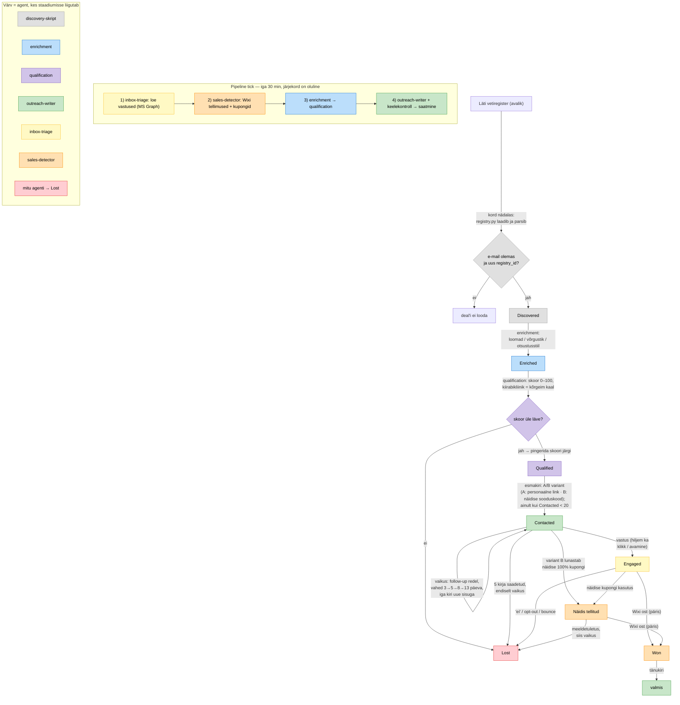

# Ravimus lead-pipeline — variant A disain

*Seis: 2026-06-12, v3 — A/B pakkumine viidud esmakirja (A: personaalne
link · B: näidise sooduskood), "Offer" asendatud "Näidis tellitud"
staadiumiga, protsessijoonis värvitud agendi järgi. v2:
[issue #1](https://github.com/Elnora-hackathon/team-17/issues/1)
tagasiside. Eelkäija: [ravimus-lead-pipeline-ideas.md](ravimus-lead-pipeline-ideas.md).*

## Ülevaade

Süsteemil on kaks rütmi:

1. **Kord nädalas** jookseb deterministlik discovery-skript (mitte
   LLM-agent): laeb Läti vetiregistri, loob Pipedrive'i deal'i **igale
   vetile, kellel on registris e-mail**. Kogu register korraga —
   voolupiirang on outreach'is, mitte discovery's.
2. **Iga 30 min** käivitab cron headless Claude Code sessiooni
   ("pipeline tick"). Tikk loeb Pipedrive'ist pipeline'i seisu,
   otsustab iga lead'i järgmise sammu ja delegeerib subagentidele.

Kogu olek elab Pipedrive'is: deal'i staadium + custom field'id. Tikk on
olekuta — katkenud tikk ei riku midagi, järgmine jätkab samast kohast.
Tiki sees töödeldakse kõigepealt *sissetulev* (vastused, ostud), siis
*väljaminev* — nii ei kirjuta süsteem kunagi lead'ile, kes juba vastas
või ostis.

## Protsessijoonis

## Pipedrive'i struktuur

### Staadiumid (üks pipeline: "ravimus-latvia-vets")

| # | Staadium | Tähendus | Kes liigutab sisse |
|---|---|---|---|
| 1 | Discovered | Registrist leitud (e-mail olemas), deal loodud | discovery-skript |
| 2 | Enriched | Taustaprofiil koos | enrichment |
| 3 | Qualified | Skoor üle läve, pingereas | qualification |
| 4 | Contacted | Esmakiri saadetud, vastust pole | outreach-writer |
| 5 | Engaged | Vastas / näitas huvi | inbox-triage |
| 6 | Näidis tellitud | Tasuta näidis lunastatud (variant B, 100% kupong), ootab päris ostu | sales-detector |
| 7 | Won | Päris Wixi ost tuvastatud | sales-detector |
| 8 | Lost | Opt-out, bounce, "ei", madal skoor või redel ammendatud | mitu agenti |

### Custom field'id deal'il

| Field | Sisu |
|---|---|
| `registry_id` | vetiregistri unikaalne ID (dedup) |
| `email` | registri e-post |
| `clinic` | kliiniku nimi, asukoht, tüüp (kiirabikliinik!) |
| `specialization` | milliste loomadega tegeleb / eriala |
| `network` | seosed teiste registri vetidega (koostöö, ülikool, ühisartiklid, sama asutus) |
| `decision_style` | faktid / praktilised tulemused / innovatsioon / kolleegide kogemus / loomade heaolu / äriareng |
| `score` | kvalifitseerimisskoor 0–100 |
| `ab_variant` | esmakirja A/B haru |
| `personal_link` | personaalne Wixi link (esmakirjast alates) |
| `discount_code` | personaalne sooduskood |
| `sample_claimed_at` | tasuta näidise lunastamise aeg (meeldetuletuse taimer) |
| `emails_sent` | saadetud kirjade arv (max 5) |
| `last_contact_at` | viimase kirja aeg |
| `lost_reason` | opt-out / bounce / said-no / unqualified / no-reply |

Kogu kirjavahetus (saadetud ja saadud) logitakse deal'i note'idena —
auditeeritavus ja järgmise kirja kontekst.

## Discovery — deterministlik skript, mitte agent

`scripts/registry.py` + `scripts/discovery.py`, ajastatud **kord
nädalas** (register muutub harva):

1. Laeb ja parsib Läti vetiregistri → `cache/registry.csv`.
2. Filtreerib: ainult kirjed, kus **e-mail on olemas**.
3. Dedup `registry_id` järgi (sh varasemad Lost-deal'id — opt-out'i
   teinud vetti uuesti ei looda).
4. Loob person + deal staadiumis Discovered — **kõik korraga**, mitte
   partiidena.

LLM-i siin pole — see samm on puhas andmetöötlus ja peab olema 100%
korratav.

## Subagendid

Agendid (`.claude/agents/`) teevad arutluse; kõik API-kõned käivad
läbi kohalike MCP serverite (vt "Tööriistakiht").

### enrichment
Iga Discovered deal'i kohta veebiotsing kolmes mõõtmes:

1. **Spetsialiseerumine** — milliste loomadega arst tegeleb, eriala,
   kliiniku tüüp (kiirabikliinik on eraldi olulise kaaluga signaal).
2. **Suhtevõrgustik** — millised teised registri vetid on temaga
   seotud: koostöö, ühine ülikool, ühisartiklid, töö samas asutuses
   samal ajal. Salvestatakse koos allikaviitega.
3. **Otsustusstiil** — mille põhjal arst tõenäoliselt otsustab:
   faktid/numbrid, praktilised tulemused, innovatsioon, kolleegide
   kogemus, loomade heaolu, äriareng. Kasutatakse kirja stiili
   kujundamisel.

Kirjutab field'id, liigutab → Enriched. Kui profiili ei õnnestu koostada,
liigub deal edasi minimaalse profiiliga (e-mail on juba registrist olemas).

### qualification
Annab **skoori 0–100** (mitte binaarset otsust) ja kirjutab põhjenduse
note'i. Skoorimisrubriik:

- **kiirabikliinikus töötamine — kõrgeim kaal** (varasem kogemus:
  parimad kliendid);
- haavaravi/kirurgia profiil ja haavasidemete kasutus;
- väikeloomapraksis (jaemüügitoode);
- aktiivne tegevusluba, toimiv e-post.

Skoor alla läve (vaikimisi 30) → Lost (`unqualified`). Üle läve →
Qualified. Outreach võtab lead'e **pingerea tipust** — kõrgeima
skooriga enne.

### outreach-writer
Staadiumiteadlik kirjutaja, töötab läti keeles. Põhimõtted:

- **Personaliseeritud**: sisu ja toon vastavalt spetsialiseerumisele,
  otsustusstiilile ja võrgustikule. Võrgustiku fakte (nt ühisartikkel
  kolleegiga) tohib nimepidi mainida, aga ainult **kontrollitavaid,
  tõeseid fakte** — mitte väiteid teiste ostude/arvamuste kohta.
- **Kirjutamise oskus tuleb skillist**: outreach-writer kasutab
  tiimi `lv-vet-email-funnel` skilli (vt
  [2026-06-12-lv-vet-email-funnel-skill-design.md](superpowers/specs/2026-06-12-lv-vet-email-funnel-skill-design.md))
  — lätikeelsed mallid, A/B praktikad, UTM-märgistus, meditsiiniseadme
  reklaaminõuded.
- **Faktid ainult lubatud allikatest**: skilli
  `references/product-ravimus-vet.md` (RavimusVET omadused,
  kliinilised väited, suurused, müügiargumendid) + Wixi tooteleht.
  Agent ei mõtle tootefakte ise välja; meditsiiniseadme väited ainult
  tõendatud kujul.
- **Iga kiri sisaldab uut infot** — uus nurk, uus pakkumine, uus
  teadusviide. Sama pakkumist ei korrata.
- **Personaalne Wixi link juba esmakirjas**; personaalne sooduskood
  vastavalt redelile.
- Iga kiri sisaldab lätikeelset loobumisrida ("atrakstīties").

**Kirjade redel** (max 5 kirja, pikenevad vahed 3 → 5 → 8 → 13 päeva):

| Kiri | Sisu |
|---|---|
| 1. esmakiri | A/B variant (A: personaalne link · B: näidise sooduskood), personaalne Wixi link |
| 2.–3. follow-up | uued nurgad, mida esmakiri ei sisaldanud: teise haru võimendus (−10% kood või tasuta näidis Wixi 100% kupongiga) |
| 4.–5. follow-up | uus sisu: teadusartikkel tema use-case'i kohta, kasutuslugu, küsimus |
| 5 kirja saadetud, vaikus | → Lost (`no-reply`) |

**A/B test esmakirjal** on lehtri põhijaotus: variant on deal'i field
(`ab_variant`), määratakse vaheldumisi. Kaks haru on **A: personaalne
link päris tootele** ja **B: näidise sooduskood** (tasuta näidis enne
ostu). Mallide täpne sõnastus on konfigureeritav ja otsustatakse enne
live'i; jaotuse telg (link vs näidis) on paigas. Redel kohandub
harule — sama pakkumist ei korrata.

Pärast koostamist käib iga kiri läbi **keelekontrolli-subagendist**
(läti keele toon, viisakusvormid, arusaadavus), alles siis saadetakse.

### inbox-triage
Loeb Graphi kaudu uued kirjad alates eelmisest tikist (delta-token
`cache/`-is). Seob saatja deal'iga. Klassifitseerib:

- huvi / küsimus / vastuväide → Engaged + ülesanne outreach-writer'ile
- selge "ei" → Lost (`said-no`) — ei on ka vastus, redel peatub
- opt-out → Lost (`opt-out`), aadress püsivasse blokeerimisnimekirja
- bounce → Lost (`bounce`)
- out-of-office → ignoreeri (redeli taimer jookseb edasi)

Tundmatult aadressilt kiri → note üldlogisse, inimesele vaatamiseks.

### sales-detector
Pollib Wixi: uued tellimused + personaalsete kupongide kasutus. Seob
ostja e-posti või kupongikoodi deal'iga. **Päris ost → Won**,
outreach-writer saadab tänukirja. **Tasuta näidise lunastus (100%
kupong) → Näidis tellitud** ja seab `sample_claimed_at` — näidis on
samm, mitte lõpp; redel jätkab kuni päris ostuni. Seostumatu tellimus
logitakse (orgaaniline müük).

## Tööriistakiht — kohalikud MCP serverid

Agendid **ei kutsu API-sid otse** ega tooreid skripte — iga väline
süsteem on kohaliku MCP serveri taga (`mcp/`-kaustas, stdio,
registreeritud `.mcp.json`-is). MCP server avab **ainult kitsad,
lubatud operatsioonid** ja jõustab kaitserauad deterministlikult —
live-süsteemi ohutus ei sõltu agendi heast käitumisest.

| Server | Lubatud tööriistad | Teadlikult puudu |
|---|---|---|
| `pipedrive-mcp` | deal'ide lugemine, staadiumimuutus, field'ide uuendus, note lisamine | kustutamine, masskirjutus, admin |
| `mail-mcp` (MS Graph) | `send_mail` (jõustab: ≤1 kiri lead'ile 24 h, max 5 kirja, opt-out blokeerimisnimekiri, DRY_RUN), `list_new_messages` | kustutamine, teiste kaustade lugemine |
| `wix-mcp` | tellimuste loetelu, personaalse kupongi loomine (sh 100% näidisekupong), kupongi kasutuse kontroll | toodete/hindade muutmine, tagasimaksed |
| `omniva-mcp` | pakiautomaadi otsing (avalik feed), saadetise registreerimine (DRY_RUN), sildi PDF, jälgimine | tühistamine, saadetise muutmine, kulleritellimused |

Jagatud API-loogika elab `lib/`-is; discovery-skript kasutab sama
teeki otse (ta on ise deterministlik kood).

**DRY_RUN on MCP-kihi lüliti**: `DRY_RUN=1` korral iga kirjutav
tööriist logib kavandatud tegevuse, aga ei tee seda. Kogu pipeline on
otsast lõpuni testitav ilma ühegi päris kirja/muudatuseta. Live'i
minek = ühe lüliti muutmine pärast dry-run'i ülevaatust.

## Orkestraator (tick)

Projekti skill `/tick`, cron käivitab headless'ina (`claude -p
"/tick"`). Algoritm:

1. `inbox-triage` — töötle saabunud kirjad.
2. `sales-detector` — kontrolli Wixi tellimusi ja kuponge.
3. Discovered deal'id → `enrichment` → `qualification`.
4. Väljaminev post ühe partiina → `outreach-writer`:
   - **Voolupiirang**: uusi esmakirju saadetakse ainult siis, kui
     Contacted-staadiumis on alla 20 deal'i; võetakse pingerea tipust.
   - Contacted, redeli järgmise kirja aeg käes → follow-up.
   - Contacted, 5 kirja täis ja vaikus → Lost.
   - Engaged (triage'i ülesanne ootel) → sisuline vastus.
   - Näidis tellitud, päris ostu pole ≥ 3 päeva → üks meeldetuletus;
     veel vaikust → Lost.
5. Kirjuta kokkuvõte `logs/tick-YYYYMMDD-HHMM.md`.

### Kaitserauad (jõustatud MCP-kihis, mitte agendi lubadustes)

- **≤ 1 kiri lead'ile 24 h jooksul.**
- **≤ 5 kirja lead'i kohta kokku**, pikenevate vahedega (3/5/8/13 päeva).
- **Esmakirjade voolupiirang**: Contacted < 20.
- **Opt-out on lõplik** — blokeerimisnimekiri, mida ka uus
  discovery-ring ei tühista.
- **Keelekontroll** enne iga saatmist.
- **DRY_RUN enne live'i on kohustuslik** (vt testimine).

## Veakäsitlus

- **MCP/API viga** (teenus maas, token aegunud): agent raporteerib,
  deal jääb puutumata, järgmine tikk proovib uuesti. Staadiumimuutus
  alles pärast õnnestunud kõnet.
- **Saatmine õnnestus, logimine ebaõnnestus**: `last_contact_at`
  uuendatakse enne note'i — topeltsaatmist ei teki; viga
  `logs/errors.md`-sse.
- **Duplikaadid**: dedup `registry_id` järgi discovery's; sama
  e-postiga teist deal'i ei looda.
- **Üheaegsed tikid**: lukufail `cache/tick.lock` — kui eelmine tikk
  jookseb, uus väljub kohe.

## Testimine ja "valmis" definitsioon

**Faas 1 — DRY_RUN (kohustuslik):** kogu pipeline jookseb päris
registri ja päris Pipedrive'i peal, aga `DRY_RUN=1` — kirju ei
saadeta, Wixi ei puututa; kõik kavandatud tegevused logitakse. Tiim
vaatab logid üle (kirjade kvaliteet, läti keel, sihtimine, redeli
loogika).

**Faas 2 — sünteetiline lead:** tiimiliige "vetina" oma e-postiga
registri CSV-s läbib täisautonoomselt (DRY_RUN väljas, ainult tema
aadress lubatud) kogu tee Discovered → Won: saab lätikeelse esmakirja
personaalse lingiga, vastab küsimusega, saab sisulise vastuse ja
pakkumise personaalse koodiga, sooritab Wixis ostu — deal liigub
Won'i ilma inimsekkumiseta. **See on projekti valmis-kontroll.**

**Faas 3 — live:** kogu register sisse, voolupiirangud hoiavad tempot.

Lisaks: iga MCP serveri smoke-test (test-deal, testkiri iseendale,
Wixi tellimuste loetelu) enne faasi 1.

## Ehitusjärjekord

1. **Pipedrive'i alus**: pipeline + staadiumid + custom field'id;
   `lib/` + `pipedrive-mcp` + smoke-test.
2. **Discovery**: `registry.py` + `discovery.py` → kõik e-mailiga
   vetid deal'idena Pipedrive'is.
3. **Tooteinfo + saatmine**: `lv-vet-email-funnel` skill paigaldatud
   (Karmeni haru, sh `product-ravimus-vet.md`); `mail-mcp` (Graph) +
   outreach-writer → esimene lätikeelne kiri DRY_RUN-is.
4. **Vastuvõtt**: inbox-triage + Graphi delta-lugemine.
5. **Profiil ja skoor**: enrichment (3 mõõdet) + qualification
   (skoorimisrubriik, kiirabikliiniku kaal).
6. **Müügituvastus**: `wix-mcp` (tellimused + personaalsed kupongid,
   sh 100% näidisekupong) + sales-detector.
7. **Orkestraator**: `/tick` + voolupiirang + lukufail + keelekontroll.
8. **Ajastus ja lõpptest**: cron (tikk 30 min, discovery kord
   nädalas) + faas 1 (DRY_RUN) + faas 2 (sünteetiline lead) → live.

Iga samm on eraldi verifitseeritav — järgmist ei alustata enne, kui
eelmise kontroll läbib.

## Lahtised punktid (kokkuleppel hilisemaks)

- **Engaged-tuvastus klikist/avamisest** (issue #1, otsus 2): praegu
  Engaged = e-kirja vastus. Hiljem lisandub personaalse lingi klikk ja
  e-maili avamine — eelistatult Wixi/Pipedrive'i sisseehitatud
  võimalustega, mitte oma jälgimisteenusega. `lv-vet-email-funnel`
  skilli UTM-raamistik (`utm_content` A/B variandi kohta) on selle
  alus: personaalne link = tooteleht + UTM-parameetrid.
- **A/B mallide täpne sõnastus** otsustatakse enne live'i; jaotuse telg
  (A: personaalne link · B: näidise sooduskood), `ab_variant` field ja
  harupõhine redel on disainis paigas.
- **Kirjavahede peenhäälestus** (otsus 3): alus 3/5/8/13 päeva, vaadatakse
  üle, kui suur plaan töötab.
- **MS Graphi tokenid** (Mail.Send, Mail.Read) ja **Wixi API võti +
  poe ID** tulevad kasutajalt; kuni siis arendame DRY_RUN-iga.
- **Läti vetiregistri täpne URL/formaat** selgub discovery-sammus.
